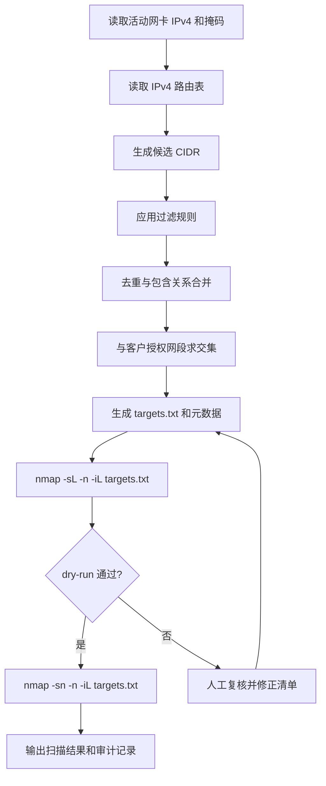

# 扫描网段自动发现规范

## 1. 目的

本文档用于规范扫描目标网段的自动发现流程，明确“候选网段从哪里来、如何过滤、如何进入扫描阶段、如何保留审计信息”。

本规范的核心目标不是让工具自动猜出所有网络，而是让流程具备以下特性：

- 可解释
- 可审计
- 可复现
- 可与授权范围对齐

## 2. 核心原则

### 2.1 nmap 是执行器，不是资产来源

`nmap` 负责执行探测，不负责判断“应该扫描哪些网段”。

网段发现应来自操作系统暴露的网络信息，例如：

- 活动网卡的 IPv4 地址和掩码
- 本机路由表
- VPN 或隧道路由
- 客户明确提供的授权网段清单

### 2.2 必须区分三件事

自动化流程中，以下三件事必须分开建模，不能混用：

1. 本机当前可以到达哪些网段
2. 客户授权扫描哪些网段
3. 这些网段应使用什么探测方式扫描

原因如下：

- 本机可达，不代表具备扫描权限
- 客户授权，不代表当前主机路由可达
- 路由可达，不代表某种探测方式一定有效

### 2.3 自动化的正确目标

自动化流程不应尝试“自动猜出客户全部网络”，而应执行以下动作：

1. 从系统中自动发现候选网段
2. 与客户授权范围求交集
3. 为每个目标网段标记来源和处理方式
4. 将结果交给扫描器执行

## 3. 候选网段来源

候选网段的来源应按优先级分层处理。

### 3.1 第一优先级：客户明确提供的网段清单

这是唯一可以直接视为“已授权范围”的来源。

要求：

- 保留原始输入
- 记录提交人、时间和工单编号
- 支持 CIDR、IP 范围或单主机格式
- 导入后统一转换为标准 CIDR 表示

### 3.2 第二优先级：本机活动网卡推导的直连网段

从活动网卡读取 IPv4 地址和掩码，换算出直连网段。

示例：

- `en0 = 192.168.20.16 / 255.255.255.0`，得到 `192.168.20.0/24`
- `en8 = 192.168.1.117 / 255.255.255.0`，得到 `192.168.1.0/24`

这类网段通常可作为“本机直连候选网段”。

### 3.3 第三优先级：路由表中显式存在的私网路由

从路由表中读取明确可达的私网路由，作为补充候选网段。

只保留满足以下条件的记录：

- 明确存在于 IPv4 路由表中
- 不是默认路由
- 目标网段属于私网或明确允许的内部保留地址段
- 可以识别出口接口或下一跳

### 3.4 第四优先级：VPN 或隧道路由

VPN 下发的网段应单独标记，不应默认全量扫描。

原因：

- VPN 常承载大量远端网段
- 实际授权范围通常小于 VPN 可达范围
- 跨三层探测的误报和漏报风险更高

建议处理方式：

- 标记为 `vpn`
- 默认进入“待人工确认”状态
- 只有在授权清单明确覆盖时才进入正式扫描清单

## 4. 自动过滤规则

候选网段生成后，必须应用统一过滤规则。

### 4.1 必须排除的目标

- 默认路由 `default`
- 回环地址 `127.0.0.0/8`
- 链路本地地址 `169.254.0.0/16`
- 组播地址 `224.0.0.0/4`
- 广播地址
- 单主机路由 `/32`

### 4.2 大网段限制

对超大网段必须设置自动化上限。

建议规则：

- 大于 `/20` 的网段不允许自动扫描
- 命中该规则时，状态标记为 `requires_manual_confirmation`
- 必须由人工确认后才能进入扫描清单

### 4.3 去重与包含关系合并

需要对重复网段和包含关系进行规整。

示例：

- 已存在 `192.168.20.0/24` 时，不再保留 `192.168.20.16/32`
- 多个来源指向同一网段时，合并为一条记录，但保留全部来源

建议保留的字段：

- `cidr`
- `sources`
- `interfaces`
- `route_type`
- `requires_manual_confirmation`

## 5. 标准执行流程

推荐将流程拆分为两层：

- 发现层：负责生成候选网段
- 扫描层：负责调用 `nmap` 或其他扫描器执行

流程图如下：



标准流程如下：

1. 从 `ifconfig` 或 `ip addr` 读取活动 IPv4 地址与掩码
2. 从 `netstat -rn -f inet` 或 `ip route` 读取 IPv4 路由
3. 生成候选私网 CIDR
4. 应用过滤、去重和合并规则
5. 与客户授权网段求交集
6. 生成 `targets.txt`
7. 先执行 dry-run
8. dry-run 通过后再正式扫描
9. 保存扫描结果与审计元数据

## 6. 扫描前校验

正式扫描前必须执行 dry-run。

建议命令：

```bash
nmap -sL -n -iL targets.txt
```

用途：

- 校验目标清单格式是否正确
- 确认扫描范围是否符合预期
- 让操作人员在真正发包前完成一次人工复核

dry-run 通过后再执行正式探测：

```bash
nmap -sn -n -iL targets.txt
```

说明：

- `-sn` 适合主机发现
- `-n` 可避免 DNS 解析带来的噪声和延迟
- 跨三层网段时，`-sn` 可能因 ACL、防火墙或 ICMP 策略而不完整

## 7. 输出与审计要求

自动化流程应同时输出扫描清单和来源清单。

建议至少保留以下信息：

- 网段
- 来源
- 来源优先级
- 出口接口
- 路由类型
- 是否属于 VPN
- 是否命中人工确认规则
- 扫描时间
- 使用的探测命令
- 在线主机数量

建议输出文件：

- `targets.txt`：最终扫描目标
- `targets.meta.json`：目标来源和属性
- `scan-summary.json`：扫描时间、命令和统计摘要

## 8. 当前主机示例结论

基于当前主机的网络信息，可得出以下候选结论：

- `192.168.20.0/24`
  来源：活动网卡 `en0`
- `192.168.1.0/24`
  来源：活动网卡 `en8`
- `100.64.0.0/10`
  来源：VPN 或隧道路由
  处理建议：标记为 VPN 段，不默认全扫

对应判断依据：

- `en0 = 192.168.20.16 / 255.255.255.0`，推导得到 `192.168.20.0/24`
- `en8 = 192.168.1.117 / 255.255.255.0`，推导得到 `192.168.1.0/24`
- 路由表显示 `192.168.20.x` 走 `en0`
- 路由表显示 `192.168.1.x` 走 `en8`

## 9. 非目标与限制

本规范默认不解决以下问题：

- 自动推断网关背后的全部 VLAN 或业务子网
- 绕过客户授权范围进行网络扩展猜测
- 依靠默认网关信息反推出全部内部拓扑

原因是本机通常只能可靠知道两类信息：

- 自己直连的网段
- 路由表中明确存在的可达网段

本机通常无法直接知道：

- 网关后方还存在多少内部子网
- 防火墙后方还有哪些业务网络
- 客户是否只授权其中的一部分

## 10. 建议的实现边界

为了便于后续替换扫描器，建议严格保持模块边界：

- 发现层只负责找候选网段并生成带来源的清单
- 扫描层只负责读取目标并调用扫描器

这样即使后续将 `nmap` 替换为 `fping`、`arp-scan` 或其他工具，也不会影响发现逻辑和审计逻辑。

## 11. 扫描结果保存方式

执行扫描时，建议优先使用 `nmap` 自带的输出参数，而不是单纯依赖 Shell 重定向。

原因如下：

- 输出格式更稳定
- 便于后续自动解析
- 可以同时保留面向人工阅读和面向程序处理的结果

### 11.1 保存为普通文本

适合人工查看扫描结果。

```bash
nmap -sn -n 192.168.1.0/24 192.168.20.0/24 -oN scan.txt
```

输出文件：

- `scan.txt`

### 11.2 保存为 XML

适合后续被脚本、平台或其他工具解析。

```bash
nmap -sn -n 192.168.1.0/24 192.168.20.0/24 -oX scan.xml
```

输出文件：

- `scan.xml`

### 11.3 保存为 Grepable 格式

适合做快速过滤、提取在线主机或进行简单文本处理。

```bash
nmap -sn -n 192.168.1.0/24 192.168.20.0/24 -oG scan.grep
```

输出文件：

- `scan.grep`

说明：

- `-oG` 仍然可用
- 如果后续需要更稳定的自动化集成，优先考虑 `-oX`

### 11.4 一次输出多种格式

如果既要人工查看，又要留给后续程序处理，推荐直接使用：

```bash
nmap -sn -n 192.168.1.0/24 192.168.20.0/24 -oA scan-result
```

输出文件：

- `scan-result.nmap`
- `scan-result.xml`
- `scan-result.gnmap`

这是最适合自动化流程落地的方式，因为一次扫描即可同时得到三类常用结果。

### 11.5 仅使用 Shell 重定向

如果只是临时保存终端输出，也可以使用：

```bash
nmap -sn -n 192.168.1.0/24 192.168.20.0/24 > scan.txt 2>&1
```

但这种方式只建议用于临时记录，不建议作为正式自动化输出格式。

### 11.6 自动化落地建议

在自动化流程中，建议约定统一输出目录，例如 `output/`，并按任务名或时间戳命名：

```bash
nmap -sn -n 192.168.1.0/24 192.168.20.0/24 -oA output/host-discovery-20260423-102500
```

这样可以同时满足以下需求：

- 保留原始扫描结果
- 避免重复覆盖旧结果
- 便于审计和回溯
